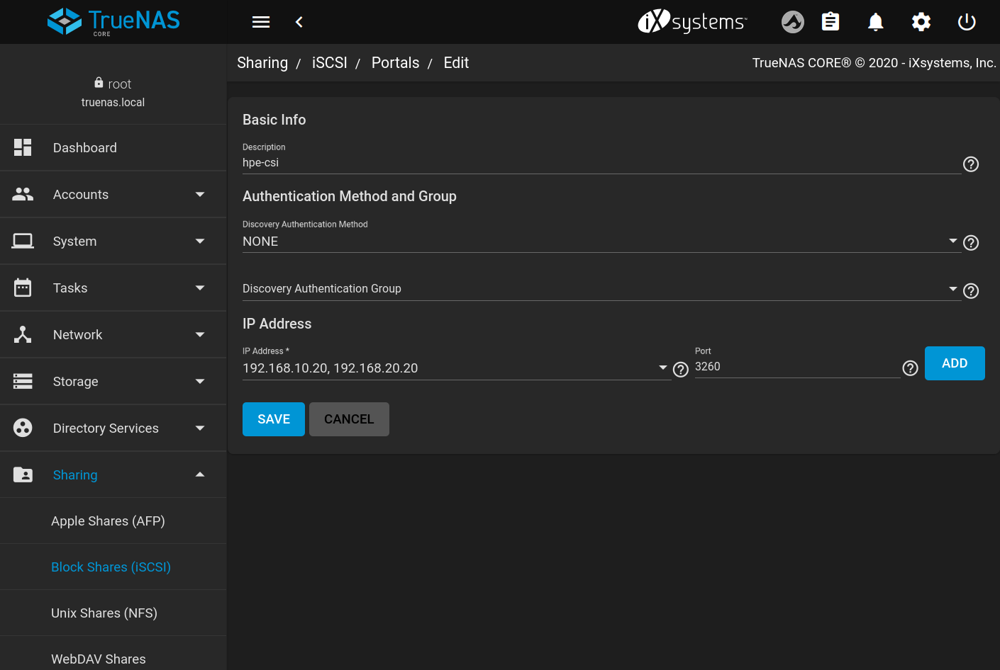
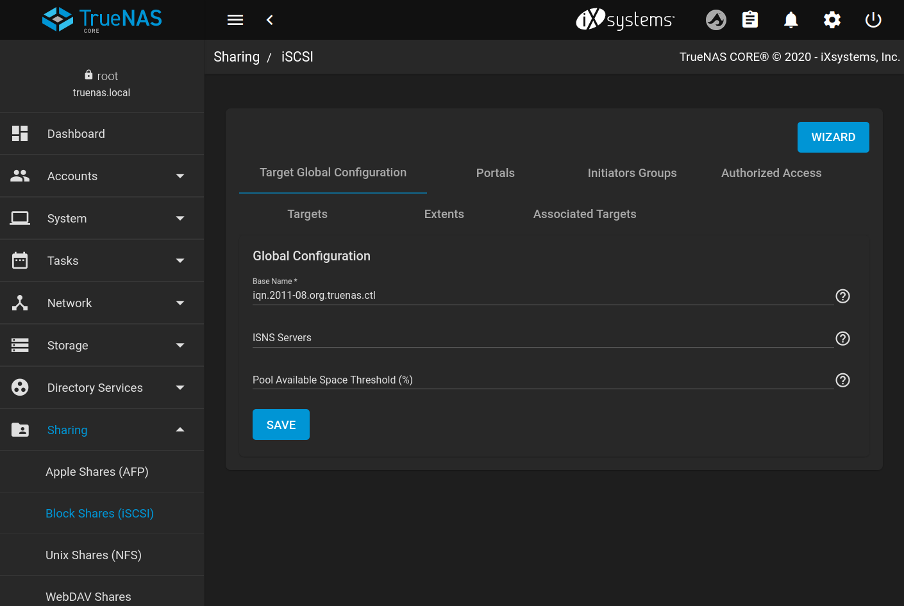

# Install TrueNAS CORE Container Storage Provider

These procedures assumes a running Kubernetes cluster [supported by the HPE CSI Driver](https://scod.hpedev.io/csi_driver/index.html#compatibility_and_support) where the worker nodes have connectivity to a TrueNAS CORE storage appliance API and networks used for iSCSI traffic. Worker nodes also need their package managers fully functional and connected to their official repos unless iSCSI and multipathing packages have been pre-installed. 

## Prerequisites

- HPE CSI Driver for Kubernetes version 1.4.0 or later
- FreeNAS/TrueNAS CORE 11.3-U5 or later

### HPE CSI Driver for Kubernetes

The HPE CSI Driver may be installed using either a Helm Chart, Operator or directly with manifests. It doesn't matter which procedure you follow but we'll be using the "[Advanced install](https://scod.hpedev.io/csi_driver/deployment.html#advanced_install)" method as you won't end up with software running on the cluster you don't need.

Install the TrueNAS CORE CSP:

```shell
kubectl create ns hpe-storage
kubectl create -f https://raw.githubusercontent.com/hpe-storage/truenas-csp/master/K8s/v1.4.0/truenas-csp.yaml
```

Install HPE CSI Driver:

```shell
kubectl create -f https://raw.githubusercontent.com/hpe-storage/co-deployments/master/yaml/csi-driver/v1.4.0/hpe-linux-config.yaml
kubectl create -f https://raw.githubusercontent.com/hpe-storage/co-deployments/master/yaml/csi-driver/v1.4.0/hpe-csi-k8s-1.20.yaml
```

**Note:** Replace `hpe-csi-k8s-<version>.yaml` with your version of Kubernetes. Also change the version of the HPE CSI Driver manifests where applicable. Using mismatching versions of the TrueNAS CORE CSP and the HPE CSI Driver will most likely **NOT** work.

Create a `Secret` that references your TrueNAS CORE appliance:

```yaml
---
apiVersion: v1
kind: Secret
metadata:
  name: truenas-secret
  namespace: hpe-storage
stringData:
  serviceName: truenas-csp-svc
  servicePort: "8080"
  username: hpe-csi
  password: TrueNAS CORE API key # For FreeNAS 11.3, set to "root:<root_password>"
  backend: TrueNAS CORE management IP address
```

**Hint:** Generate an API key by clicking the cog in the upper right corner of the TrueNAS CORE web UI. What you name the key or the `Secret` `{.stringData.username}` does not matter as it's not being used or referenced during runtime. For tracking purposes it might be a good idea to name the key the same as the username put into the `Secret`.

### TrueNAS CORE

The TrueNAS appliance require an iSCSI portal to be configured manually with the following characteristics:



- Description: `hpe-csi`
- IP Address: List of IPs used for iSCSI (do NOT use 0.0.0.0)

The Target Global Configration needs to be updated with this Base Name:



- Base Name: `iqn.2011-08.org.truenas.ctl`

**Hint:** If TrueNAS is not giving you the option to select nothing but 0.0.0.0 in the portal configuration is because you're using DHCP. Only statically assigned addresses can be used in the picker.

Also make sure the iSCSI service is started and enabled at boot on TrueNAS.

The default location for CSI volumes will be in the root of a pool named `tank`. That is most likely not desirable, instead, create a dataset in any of your pools and make note of that, i.e `zwimming/csi-volumes` and configure `root` in the `StorageClass`.

## Example StorageClass

All the ZVols created on TrueNAS will by default be created with these parameters:

- volblocksize: 8K
- deduplication: OFF
- compression: LZ4
- sparse: "true"
- sync: STANDARD
- description: "Dataset created by HPE CSI Driver for Kubernetes"
- root: tank

These parameters may be overriden in the `StorageClass` or have the defaults altered by passing environment variables to the CSP runtime with the convention of `DEFAULT_COMPRESSION=OFF`. 

Refer to the TrueNAS CORE documentation what these dataset parameters do.

**Note:** Since the iSCSI volumes are backed by ZVols, `volblocksize` will be immutable.

```yaml
---
apiVersion: storage.k8s.io/v1
kind: StorageClass
metadata:
  annotations:
    storageclass.kubernetes.io/is-default-class: "true"
  name: hpe-storageclass
provisioner: csi.hpe.com
parameters:
  csi.storage.k8s.io/controller-expand-secret-name: truenas-secret
  csi.storage.k8s.io/controller-expand-secret-namespace: hpe-storage
  csi.storage.k8s.io/controller-publish-secret-name: truenas-secret
  csi.storage.k8s.io/controller-publish-secret-namespace: hpe-storage
  csi.storage.k8s.io/node-publish-secret-name: truenas-secret
  csi.storage.k8s.io/node-publish-secret-namespace: hpe-storage
  csi.storage.k8s.io/node-stage-secret-name: truenas-secret
  csi.storage.k8s.io/node-stage-secret-namespace: hpe-storage
  csi.storage.k8s.io/provisioner-secret-name: truenas-secret
  csi.storage.k8s.io/provisioner-secret-namespace: hpe-storage
  csi.storage.k8s.io/fstype: xfs
  allowOverrides: sparse,compression,deduplication,volblocksize,sync,description
  root: zwimming/csi-volumes
reclaimPolicy: Delete
allowVolumeExpansion: true
```

Set `root` to a dataset that will serve as the base dataset where the ZVols will be created. The `allowOverrides` parameter will allow users to annotate their PVCs with the values that makes sense for their workload. [Learn more here](https://scod.hpedev.io/csi_driver/using.html#using_pvc_overrides).

**Important:** Do NOT use underscore "`_`" in your root dataset for now, it will most likely break.

Once the `Secret` and `StorageClass` have been created, all functionality is provided by the HPE CSI Driver and is [documented here](https://scod.hpedev.io/csi_driver/using.html).
